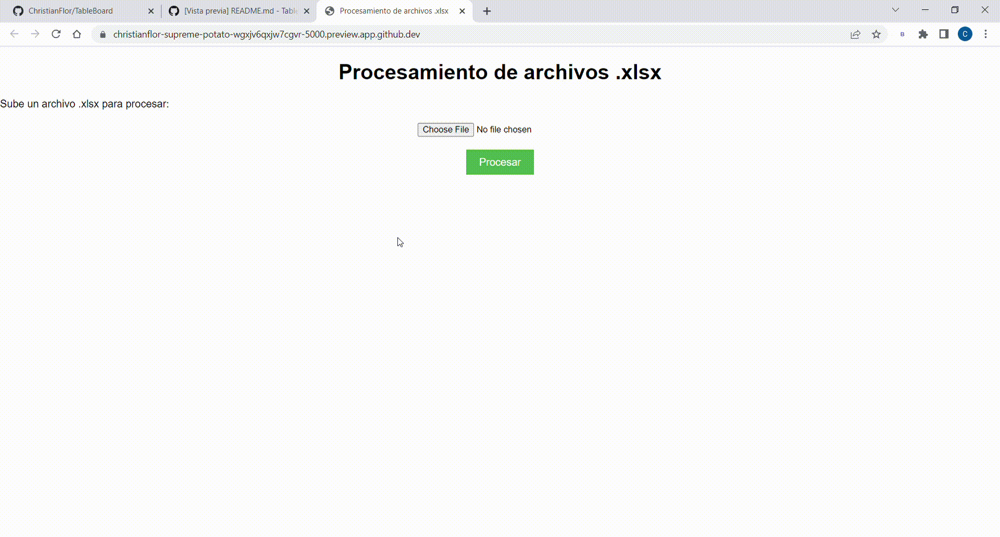

# TableBoard

1. Asegúrate de tener instalado Python 3 en tu computadora.
2. Descarga todos los archivos de la aplicación y guárdalos en una carpeta.
3. Abre una terminal y navega hasta la carpeta donde se encuentran los archivos de la aplicación.
4. Crea un entorno virtual ejecutando el siguiente comando en la terminal: 
```bash 
python3 -m venv venv 
```    
5. Activa el entorno virtual ejecutando el siguiente comando en la terminal:
```bash 
En Windows: venv\Scripts\activate
En macOS/Linux: source venv/bin/activate
```    
6. Instala todas las dependencias necesarias ejecutando el siguiente comando en la terminal: 
```bash 
pip install -r requirements.txt 
pip install flask-wtf flask-talisman flask-limiter
pip install --upgrade pandas
```   
7. Ejecuta la aplicación con el siguiente comando: 
```bash
python app.py
``` 
8. Abre tu navegador web y navega a http://localhost:5000.
9. En la página web, selecciona el archivo .xlsx que quieres procesar y haz clic en "Procesar archivo".
10. Espera a que la aplicación procese el archivo. Una vez que se haya completado, aparecerá un enlace para descargar el archivo .csv generado.
11. Cuando hayas terminado de usar la aplicación, puedes desactivar el entorno virtual ejecutando el siguiente comando en la terminal: deactivates



# Para docker
```bash
docker build -t nombre_de_la_imagen .
docker run -p 5000:5000 nombre_de_la_imagen
``` 
 [Web CITRADI](https://www.icesi.edu.co/centros-academicos/citradi/)

 ## Hecho por:
+ [Christian David Flor Astudillo](https://github.com/ChristianFlor "Christian Flor")
+ [Robin Castro Gil ](https://scholar.google.ca/citations?user=yjRyd6gAAAAJ&hl=en "Robin Castro Gil")
